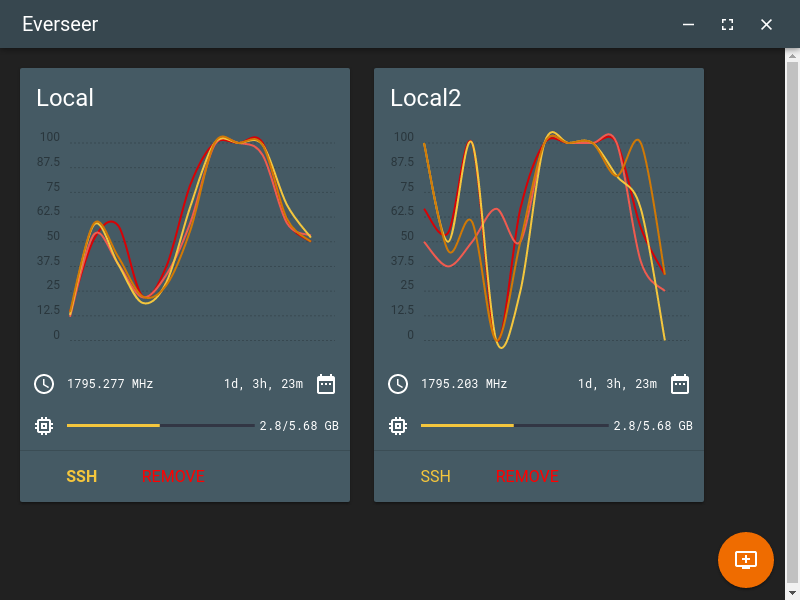

#Everseer: multi-machine system monitor

	This program is free software: you can redistribute it and/or modify
	it under the terms of the GNU General Public License as published by
	the Free Software Foundation, either version 3 of the License, or
	(at your option) any later version.

	This program is distributed in the hope that it will be useful,
	but WITHOUT ANY WARRANTY; without even the implied warranty of
	MERCHANTABILITY or FITNESS FOR A PARTICULAR PURPOSE.  See the
	GNU General Public License for more details.

	You should have received a copy of the GNU General Public License
	along with this program.  If not, see <http://www.gnu.org/licenses/>.

Everseer is a real system monitor for multiple remote machines. It allows to monitor CPU and memory usage in real time.

It has two parts: a client app, and a server app.

###Client
#####`/everseer_client`

The Everseer client is written using **Electron** (the same technology behind the [Atom text editor](https://atom.io/)). It can be easily run on any platform, including **Linux**, OS X and Windows.

As I don't have any Windows or OS X machines, nor I plan to get any in the future, the main supported platform will be Linux. I will howerver accept bug reports and pull requests specific to those two platforms, and I will do my best to keep the app working well on all platforms.

###Server
#####`/everseer_server`

The Everseer server is built using **Django**.

The server app is exclusively compatible with Linux, since most servers run Linux anyway this shouldn't be a problem. If you need to make the server app compatible with other operating systems, all you have to do is edit the `/everseer_server/monitorapi/sysmon.py` file and adapt the system calls to your target system.

##Installation
####Client

*TODO: distribute pre-packaged versions*
#####Advanced (useful for development)

- Make sure you have `npm`, `node.js` and `electron` installed globally in your system
- Clone the repository like this: `git clone https://github.com/GabMus/Everseer`
- `cd` in the `Everseer/everseer_client/` directory
- Run `npm start` and the application should be launching correctly

####Server

- Make sure you have `django` installed (best to install it from `pip`; depending on your distribution the package name could be `python-django` or similar)
- Use your favourite web server to deploy the django app (Apache and nginx are both fine; I won't explain how to deploy the django app myself, since there are many tutorials online, including the django documentation itself)
- Change the API key in `Everseer/everseer_server/monitorapi/views.py`; the suggested way to easily generate an API key is using the output from `head -n 30 /dev/urandom | sha512sum`
